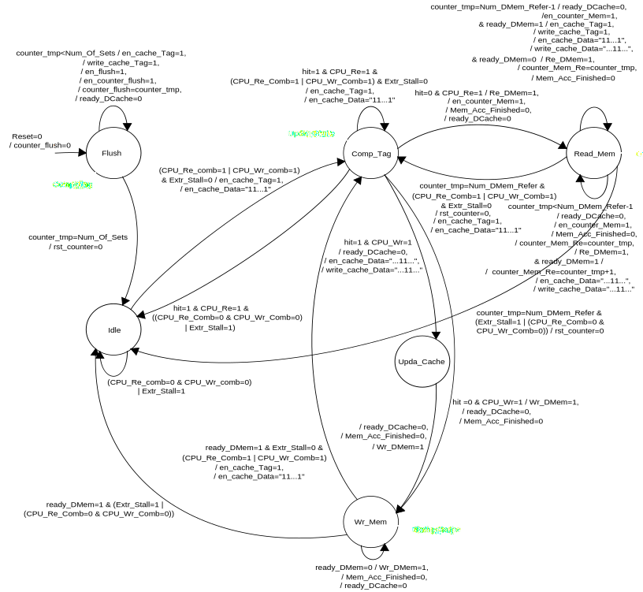
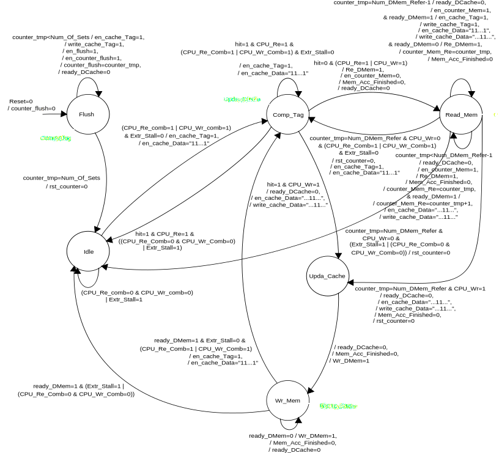

### RTL-Model-L1Caches

```diff
- This project is done as master thesis at University of Chalmers computer engineering department
```
http://www.cse.chalmers.se/research/group/vlsi/flexsoc/downloads.shtml

<p>
Level-1 (L1) cache memories are complex circuits that tightly integrate memory, logic, and state machines near the processor
datapath. During the design of a processor-based system, many different cache configurations that vary in, for example, size, 
associativity, and replacement policies, need to be evaluated in order to maximize performance or power efficiency.
Since the implementation of each cache memory is a time-consuming and error-prone process, a configurable and synthesizable model
is very useful as it helps to generate a range of caches in a quick and reproducible manner. Comprising both a data and
instruction cache, the RTL cache model that we present has a wide array of configurable parameters. Apart from different cache
size parameters, the model also supports different replacement policies, associativities, and data write policies. The model is
written in VHDL and fits different processors in ASICs and FPGAs. To show the usefulness of the model, we provide an example of cache configuration exploration.
</p>


**Instruction Cache Datapath:**<br/>


**Instruction Cache Controller:**<br/>


**Data Cache Controller(write through with no allocation):**<br/>


**Data Cache Controller(write through with allocation):**<br/>


**Data Cache Controller(write back with allocation):**<br/>


**Arbiter Controller:**<br/>


**Instruction and Data Cache top level system untegration:**<br/>

